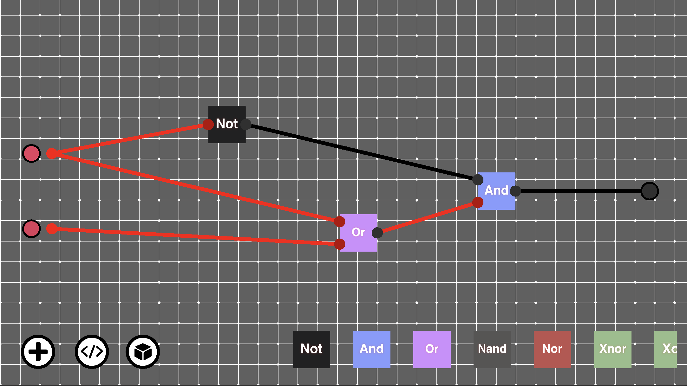
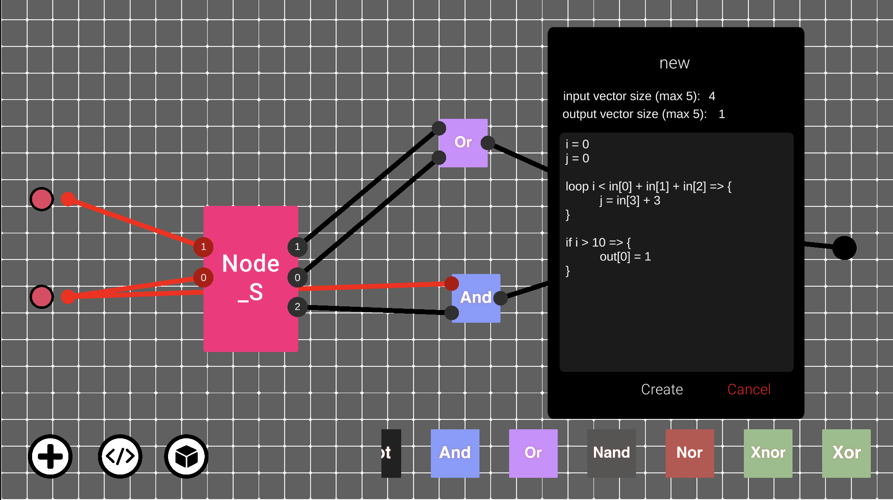

# Stratopreter

Stratopreter is an innovative web simulator built for Syntax Error, designed to provide a rich, interactive user experience. 

Additionally the simulator itself is run on <a href="https://unity.com/">Unity</a> and feautures 

* 7 Basic Logic Gates
  * and
  * or
  * not
  * nand
  * nor
  * xor
  * xnor
* <a href="https://github.com/IshaanXCoder/SyntaxError-Team-Strato/tree/main/Interpreter/Sugar.Interpreter">A Custom Interpreter</a>
* Prefab Gates
* Programmable Gates

## Tech Stack
- **Unity 2D**: The app uses Unity to run the base simulator
- **C# .and netstandrd2.1**: The interpreter itself is written in C# 8.0. <a href="https://learn.microsoft.com/en-us/dotnet/standard/net-standard?tabs=net-standard-1-0">.netstandard</a> allows it to be impored to Unity and other C# projects as independant reference

## Tech Stack
- **Unity 2D**: The app uses Unity to run the base simulator
- **C# .and netstandrd2.1**: The interpreter itself is written in C# 8.0. <a href="https://learn.microsoft.com/en-us/dotnet/standard/net-standard?tabs=net-standard-1-0">.netstandard</a> allows it to be impored to Unity and other C# projects as independant reference

### Prerequisites:
- Unity 2021.3.45f1
- .netstandard 2.1

### Prefab Gates
They're exactly what they sound like. `Prefabs` help users create complex and dynamic combinations of gates to represent higher structures. Stratopreter makes sure that they're reusable and easy to manage, even in large projects!

### Programmable Gates
Even with the fantastic awesomeness of prefabs, rebuilding the wheel from scratch might be a difficult task. So Stratopreter presents the `programmable node`. Featuring a custom interpretted beginner friendly language, Stratopreter makes it easy to prototype complex behaviours in just a few lines of code.

> 

> 

